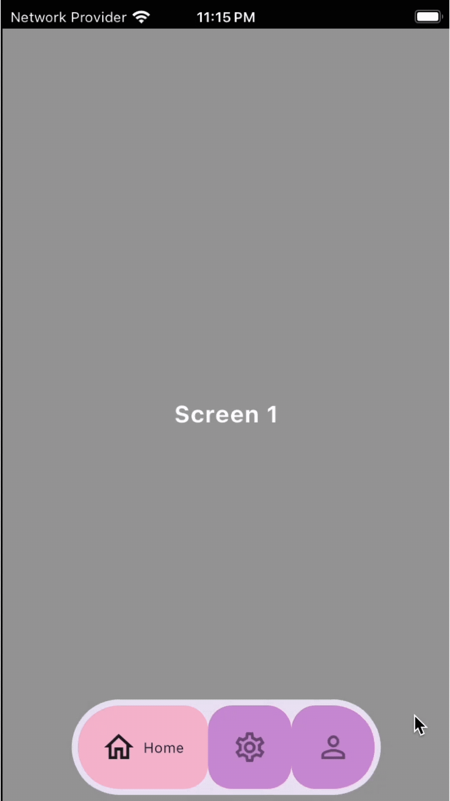

# 🫧 Animated Bubble Navigation Bar

A **lightweight**, **customizable**, and **responsive** navigation bar for Flutter with smooth bubble animations.

Perfect for modern apps with stylish transitions, adaptive layouts, and full customization.

---


## 📸 Bubble Preview

| Demo                          | Preview                                                                                                                                 |
| ----------------------------- | --------------------------------------------------------------------------------------------------------------------------------------- |
| 💡 Default Bubble Animation   |    |
| 🎨 Custom Icons & Labels      |       |
| 📱 Responsive Across Devices  |  |
| 🔁 Seamless Tab Switching     |     |
| 🧱 Square/Alternative Layouts |     |

---

## ↕️ Orientation & Alignment Support


---

## 📸 Screen Transition Preview with Code

### 💡 Scaling + Fading and Sliding Effect


```dart
screenTransitionBuilder: (child, animation) {
  final curved = CurvedAnimation(parent: animation, curve: Curves.easeOutExpo);
  return FadeTransition(
    opacity: curved,
    child: ScaleTransition(
      scale: Tween<double>(begin: 0.95, end: 1).animate(curved),
      child: SlideTransition(
        position: Tween<Offset>(begin: Offset(0.1, 0.1), end: Offset.zero)
            .animate(curved),
        child: child,
      ),
    ),
  );
},
```

---

### 🎨 Flip + Fade Effect


```dart
screenTransitionBuilder: (child, animation) {
  final rotate = Tween<double>(begin: 1, end: 0).animate(animation);
  return AnimatedBuilder(
    animation: rotate,
    builder: (context, childWidget) {
      final isUnder = (rotate.value > 0.5);
      final angle = (1 - rotate.value) * 3.14;
      return Transform(
        transform: Matrix4.rotationY(angle),
        alignment: Alignment.center,
        child: Opacity(
          opacity: isUnder ? 0.5 : 1,
          child: childWidget,
        ),
      );
    },
    child: child,
  );
},
```


---

### 📱 Blur & Fade Effect


```dart
screenTransitionBuilder: (child, animation) {
  return FadeTransition(
    opacity: animation,
    child: BackdropFilter(
      filter: ImageFilter.blur(
        sigmaX: (1 - animation.value) * 10,
        sigmaY: (1 - animation.value) * 10,
      ),
      child: child,
    ),
  );
},
```


---

### 🔁 Slide + Elastic Effect


```dart
screenTransitionBuilder: (child, animation) {
    final curved =
        CurvedAnimation(parent: animation, curve: Curves.elasticOut);
    return SlideTransition(
      position: Tween<Offset>(
        begin: Offset(1.0, 0.0),
        end: Offset.zero,
      ).animate(curved),
      child: child,
    );
  },
```


---
#### To manage the transition effects duration, you must set the `screenTransitionDuration` (default is Duration(milliseconds: 300)).

---

> The transition effects are customizable and scalable — bring your creativity to craft even more stunning and futuristic animations tailored to your app's unique vibe.
## ✨ Features

* 🔹 Clean, modern design
* 🫧 Bubble-style animations
* 🛠 Fully customizable (icons, labels, colors, shape, alignment, orientation)
* 🔁 Seamless tab switching
* 📱 Responsive across devices (phones & tablets)
* 🧩 Easy integration & minimal setup

---

## 🚀 Getting Started

### 1️⃣ Add to `pubspec.yaml`

```yaml
dependencies:
  animated_bubble_navigation_bar: ^<latest_version>
```

### 2️⃣ Import the package

```dart
import 'package:animated_bubble_navigation_bar/animated_bubble_navigation_bar.dart';
```

### 3️⃣ Basic Usage

```dart
Scaffold(
  body: AnimatedBubbleNavBar(
    screens: [
      Screen1(),
      Screen2(),
      Screen3(),
    ],
    menuItems: [
      BubbleItem(label: "Home", icon: Icons.home),
      BubbleItem(label: "Settings", icon: Icons.settings),
      BubbleItem(label: "Profile", icon: Icons.person),
    ],
    bubbleDecoration: BubbleDecoration(), // Decoration
  ),
);
```

---


### 4️⃣ Styling Colors and Icons

```dart
bubbleDecoration: BubbleDecoration(
  // Background color of the bar
  backgroundColor: Colors.deepPurple,

  // Bubble/Item colors
  selectedBubbleBackgroundColor: Colors.white,
  unSelectedBubbleBackgroundColor: Colors.grey.shade800,

  // Label colors
  selectedBubbleLabelColor: Colors.black,
  unSelectedBubbleLabelColor: Colors.white70,

  // Icon colors
  selectedBubbleIconColor: Colors.black,
  unSelectedBubbleIconColor: Colors.white,

  // Label style
  selectedBubbleLabelStyle: TextStyle(fontSize: 13, fontWeight: FontWeight.w600),
  
  unSelectedBubbleLabelStyle: TextStyle(fontSize: 14, fontWeight: FontWeight.bold),

  // Icon size
  iconSize: 28
),

```

### 5️⃣ Advance Layout and Behavior

```dart
bubbleDecoration: BubbleDecoration(
  // Space between icon and label
  innerIconLabelSpacing: 6,

  // Scrolling physics
  physics: BouncingScrollPhysics(),

  // Size of bubble item container
  bubbleItemSize: 12,

  // Bubble Animation duration
  bubbleDuration: Duration(milliseconds: 350),

  // Screen Transitions
  screenTransitionDuration: null,
  screenTransitionBuilder: null,

  // Margin & padding
  margin: EdgeInsets.symmetric(horizontal: 6, vertical: 8),
  padding: EdgeInsets.symmetric(horizontal: 8, vertical: 10),

  // Animation curve
  curveIn: Curves.easeIn,
  curveOut: Curves.easeOut,

  // Axis orientation
  curveOut: Axis.horizontal,

  // Bubble position (e.g., bottomCenter, topRight, etc)
  alignment: Alignemnt.centerLeft,

  // Shape of bubble (circular or square)
  shapes: BubbleShape.square,

  // Optional radius for square bubbles
  squareBordersRadius: null,

),
```

---

## 📘 API Reference

| Property           | Type                          | Description                            |
| ------------------ | ----------------------------- | -------------------------------------- |
| `screens`          | `List<Widget>`                | Screens shown for each tab             |
| `menuItems`        | `List<BubbleItem>`         | Navigation items (iconData + icon widget + label)        |
| `bubbleDecoration` | `BubbleDecoration` | Custom animation, colors, shapes, etc. |
| `initialIndex` | `int` | Initial index of the bubble in nav bar. |


### 🧩 `BubbleItem`

Represents an item inside the custom bottom navigation bar. Used to define label and icon representation for each tab.

```dart
class BubbleItem {
  final String lable;
  final Widget? iconWidget;
  final IconData? icon;

  const BubbleItem({
    required this.lable,
    this.iconWidget,
    this.icon,
  });
}
```

| Property     | Type        | Description                                                                 |
| ------------ | ----------- | --------------------------------------------------------------------------- |
| `lable`      | `String`    | The text label shown under or beside the icon.                              |
| `icon`       | `IconData?` | Standard icon from Flutter’s `Icons` class. |
| `iconWidget` | `Widget?`   | A custom widget for the icon. Takes precedence after `icon`, if not provided.     |

> **Use case:** Allows flexibility to use either a Flutter `IconData` or a fully customized widget (like an SVG or image) for your bottom nav icons.

---

### 🎨 `BubbleDecoration`

Controls the visual appearance and animations of the entire bubble-style bottom navigation bar. Use this class to fully customize how each navigation item looks and behaves.

```dart
class BubbleDecoration {

  // Colors
  final Color backgroundColor;
  final Color selectedBubbleBackgroundColor;
  final Color unSelectedBubbleBackgroundColor;
  final Color selectedBubbleLabelColor;
  final Color unSelectedBubbleLabelColor;
  final Color selectedBubbleIconColor;
  final Color unSelectedBubbleIconColor;

  // TextStyles
  final TextStyle selectedBubbleLabelStyle;
  final TextStyle unSelectedBubbleLabelStyle;

  // Icons
  final double iconSize;
  final double innerIconLabelSpacing;
  final double bubbleItemSize;

  // Behavior & Animation
  final ScrollPhysics physics;
  final Duration bubbleDuration;
  final Curve curveIn;
  final Curve curveOut;

  // Screen Transition
  final Duration? screenTransitionDuration;
  final AnimatedSwitcherTransitionBuilder? screenTransitionBuilder;

  // Padding & Margin
  final EdgeInsets margin;
  final EdgeInsets padding;

  // Layout & Shape
  final Axis axis;
  final Alignment alignment;
  final BubbleShape shapes;
  final double? squareBordersRadius;
}
```

#### 🎨 Colors

| Property                          | Type    | Description                                             |
| --------------------------------- | ------- | ------------------------------------------------------- |
| `selectedBubbleBackgroundColor`   | `Color` | Background color of the active (selected) bubble item.  |
| `unSelectedBubbleBackgroundColor` | `Color` | Background color of inactive (unselected) bubble items. |
| `selectedBubbleLabelColor`        | `Color` | Text color of the active item label.                    |
| `unSelectedBubbleLabelColor`      | `Color` | Text color of inactive item labels.                     |
| `selectedBubbleIconColor`         | `Color` | Icon color of the active bubble item.                   |
| `unSelectedBubbleIconColor`       | `Color` | Icon color of inactive bubble items.                    |
| `backgroundColor`                 | `Color` | Overall background color of the navigation bar.         |

#### 📝 Text

| Property     | Type        | Description                                  |
| ------------ | ----------- | -------------------------------------------- |
| `selectedBubbleLabelStyle` | `TextStyle` | Font size, weight, and style for selected bubble. |
| `unSelectedBubbleLabelStyle` | `TextStyle` | Font size, weight, and style for unselected bubbles. |

#### 🖼️ Icon & Item Size

| Property                | Type     | Description                                                        |
| ----------------------- | -------- | ------------------------------------------------------------------ |
| `iconSize`              | `double` | Size of the icon inside each bubble.                               |
| `innerIconLabelSpacing` | `double` | Space between icon and label within a bubble item.                 |
| `bubbleItemSize`        | `double` | Used for layout spacing/scaling – affects visual balance of items. |

#### ⚙️ Behavior & Animation

| Property   | Type            | Description                                                         |
| ---------- | --------------- | ------------------------------------------------------------------- |
| `physics`  | `ScrollPhysics` | Defines how scrolling behaves if bar is scrollable.                 |
| `duration` | `Duration`      | Duration of animations when switching between items.                |
| `curveIn`    | `Curve`         | Animation curve used for transitions (e.g., `easeIn`, `bounceOut`). |
| `curveOut`    | `Curve`         | Animation curve used for transitions (e.g., `easeIn`, `bounceOut`). |
| `screenTransitionDuration`    | `Duration`         | Animation duration used for transitions between screens/tabs. |
| `screenTransitionBuilder`    | `Widget Function(Widget, Animation<double>)`         | Defines the animation used when switching between screens; defaults to a FadeTransition. |


#### 🧱 Padding & Margin

| Property  | Type         | Description                               |
| --------- | ------------ | ----------------------------------------- |
| `margin`  | `EdgeInsets` | External spacing around each bubble item. |
| `padding` | `EdgeInsets` | Internal spacing within each bubble item. |

#### 🔁 Layout & Shape

| Property              | Type              | Description                                                                |
| --------------------- | ----------------- | -------------------------------------------------------------------------- |
| `axis`     | `Axis` | Defines the orientation of nav bar (e.g., vertically , horizontally) .       |
| `alignment`     | `Alignment` | Defines how the nav bar is aligned (e.g., bottom ,left, right etc.).       |
| `shapes`              | `BubbleShape`     | Defines shape style – e.g., circular or square.                            |
| `squareBordersRadius` | `double?`         | This controls the Bubbles borders radius (corner roundness). |

---

## 🧱 Customization

* Icon & label styles
* Active/inactive colors
* Bubble shapes (rounded, square)
* Animation curve, duration, and more
* Bottom Navigation Bar, Top Tab Bar, Side Menu Bar

---

## 🛤 Coming Soon

* 🔔 Badge support
* ➕ FAB (Notched) support
* 🌀 More animation styles

---


## 🤝 Contributing

We welcome contributions! To contribute:

1. Fork the repo
2. Create a new branch
3. Make your changes with proper testing
4. Open a PR with a clear description

For new features, open an issue first to discuss ideas before implementation.

---

## ⭐️ Support

If you find this package helpful:

* Leave a ⭐️ on GitHub and Like on Pub.dev
* Share with the Flutter community
* Submit feature requests or bug reports

---


## 🧑‍💻 Developer

**Muhammad Ahmed Lashari**
[LinkedIn](https://www.linkedin.com/in/muhammad-ahmed-lashari-826761289/) | [GitHub](https://github.com/Ahmed-lashari) | 📧 [Email](mailto:ahmedlashari.official@gmail.com)


---

Let’s build something beautiful — one bubble at a time! 🫧

---