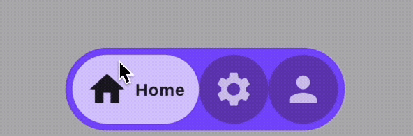
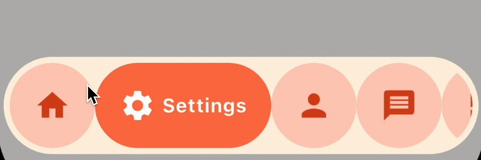
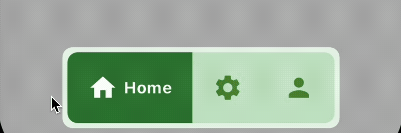

# Animated Bubble Navigation Bar

A lightweight and customizable animated bottom navigation bar for Flutter apps.
**Perfect for modern UI/UX with bubble-style animation and smooth transitions.**

---

## ✨ Features

* Clean, responsive design
* Bubble-style animation
* Easy to integrate
* Fully customizable (icons, colors, active/inactive states)
* Supports multiple tabs.
* Ideal for dashboard and tab-based navigation

---

## 🚀 Getting Started

Add the package to your `pubspec.yaml`:

```yaml
dependencies:
  animated_bubble_navigation_bar: ^<latest_version>
```

Import it in your Dart code:

```dart
import 'package:animated_bubble_navigation_bar/animated_bubble_navigation_bar.dart';
```

---

## Demo
## 📦  Example

```dart
Scaffold(
     body: AnimatedBubbleNavBottomBar(
         screens: [ Screen1(), Screen2(), Screen3() ],
         menuItems: [
           BottomNavItem(lable: "Home", icon: Icons.home),
           BottomNavItem(lable: "Settings", icon: Icons.settings),
           BottomNavItem(lable: "Person", icon: Icons.person)
         ],
         bobbleDecoration: BubbleDecoration()
     )
);
```

---

## 📸 Demos

### 💡 Default Bubble Animation

A smooth, classic bubble animation on tab switch.


---

### 🎨 Custom Icons & Animated Labels

Customize icons, labels, and bubble animations to match your brand.


---

### 📱 Responsive Across Devices

Tested on tablets and phones with adaptive layouts.


---

### 🔁 Seamless Tab Switching

Snappy and animated transitions between navigation items.


---

### 🧱 Alternative Bubble Layouts

Try square or other non-rounded bubble styles for unique UIs.


---


## 📚 API Reference

| Property          | Type                  | Description                |
| ----------------- | --------------------- | -------------------------- |
| `screens`           | `List<Widget> ` | List of Screen   |
| `menuItems`           | `List<BottomNavItem>` | List of navigation items   |
| `bobbleDecoration`           | `BubbleDecoration()` | Decoration  |

---

## ✅ Coming Soon

* Badge support
* TAB Bar Support
* Notched FAB support
* More animation styles

---

## 🛠 Developer

Developed and maintained by Muhammad Ahmed Lashari.


---


## 🤝 Contributing

We welcome contributions from the Flutter community to make **Animated Bubble Navigation Bar** more powerful and flexible. Whether it’s fixing bugs, adding features, improving documentation, or suggesting enhancements—your input is valued.

If you're interested in contributing:

* 📂 Fork the repository
* 📌 Create a feature branch
* ✅ Make your changes and ensure they are well-tested
* 🔄 Submit a pull request with a clear description

For larger changes or new features, please consider opening an issue first to discuss the proposal.

---

## 📬 Contact & Community

For discussions, feature requests, or professional connections:

* 💼 Connect on  [LinkedIn](https://www.linkedin.com/in/muhammad-ahmed-lashari-826761289/)
* 💻 Follow on [GitHub](https://github.com/Ahmed-lashari)
* 📧 Reach out via [Email](ahmedlashari.official@gmail.com)

Let’s build something great together.

---
